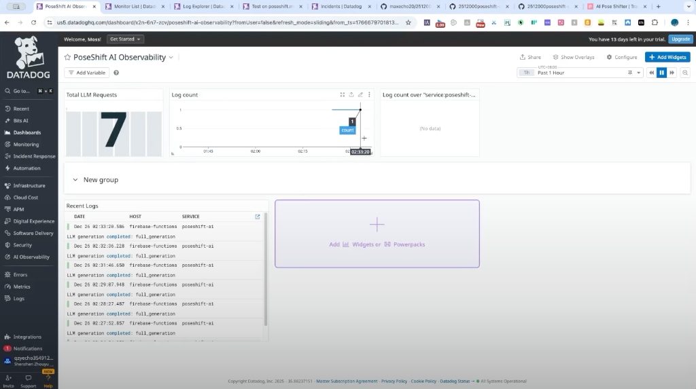

# PoseShift AI — Datadog LLM Observability Demo

> 🏆 **Submission for AI Partner Catalyst Hackathon - Datadog Challenge**

Creating perfect pose transformations with AI, monitored end-to-end by Datadog.

---

## 🔗 Quick Links

| Resource | Link |
|----------|------|
| **🎬 Demo Video** | [YouTube](https://youtu.be/Pb90KwYupK4) |
| **🌐 Live Application** | [poseshift.mossecho.cn](https://poseshift.mossecho.cn) |
| **📊 Datadog Account** | qzyecho354912808@gmail.com |

---

## 👋 About the Developer

Hi! I'm **Max**, a solo developer with **no formal programming background**. 

This is my **first-ever software project** — built entirely from scratch while learning along the way. Every feature, every bug fix, every line of code was a learning experience.

I would **love your feedback** — whether it's suggestions for improvement, bug reports, or just a hello! 🙏

---



## 🚀 Overview

**PoseShift** is an AI-powered application that allows users to transfer a pose from a reference image to a target person while preserving their identity and style. 

This repository demonstrates a **production-grade implementation** of observability for Generative AI applications using **Datadog APM** and **LLM Observability**. It showcases how to track complex AI pipelines, monitor costs/tokens (simulated), and ensure reliability in a serverless environment (Firebase Cloud Functions).

### Key Features
- **Pose Analysis & Generation**: Uses Google Gemini 1.5 Flash & Pro models.
- **Serverless Architecture**: Built on Firebase Cloud Functions (Node.js 20).
- **Full Observability**: Integrated `dd-trace` for distributed tracing and LLM metrics.

---

## 📊 Observability Strategy

We implemented a comprehensive observability strategy to ensure the reliability and performance of our AI features.

### 1. APM Tracing (Distributed Tracing)
We use `dd-trace` to verify the entire request lifecycle:
- **Root Span**: `firebase.request` (handled by Datadog)
- **Service Span**: `generateWithAI` function execution
- **LLM Spans**: Broken down into specific operations:
  - `llm.pose_analysis` (Gemini 1.5 Flash)
  - `llm.image_generation` (Gemini 1.5 Pro)

### 2. Custom Metrics (Fallback & Business Logic)
To handle serverless flush constraints and track business KPIs, we implemented dual-channel reporting:
- **Direct API Reporting**: Uses Datadog HTTP API (`v1/series`, `v2/logs`) to ensure critical metrics are sent even if the runtime freezes immediately.
- **Key Metrics**:
  - `poseshift.llm.request.count`: Total generation requests.
  - `poseshift.llm.request.latency`: End-to-end processing time.
  - `poseshift.llm.error.count`: Generation failures.

### 3. Log Management
Structured logging injected with trace IDs allows us to correlate every log line with a specific user request and AI generation trace.

---

## 🛠 Project Structure

```bash
.
├── functions/
│   └── src/
│       ├── index.ts          # Cloud Function entry point
│       ├── geminiService.ts  # Core AI logic with Datadog instrumentation
│       ├── datadog.ts        # Tracer initialization
│       └── datadogApi.ts     # Direct API fallback implementation
├── scripts/
│   └── traffic_generator.js  # Script to simulate traffic patterns
├── datadog-exports/          # JSON exports of Dashboards & Monitors
│   ├── dashboard.json
│   └── monitors.json
└── docs/
    └── screenshots/          # Evidence of observability
```

---

## ⚙️ Setup & Deployment

### Prerequisites
- Node.js 20+
- Firebase CLI
- Datadog Account & API Key

### Installation

1. Clone the repository:
   ```bash
   git clone https://github.com/maxecho20/2512000poseshift-datadog.git
   cd 2512000poseshift-datadog
   ```

2. Install dependencies:
   ```bash
   npm install
   ```

3. Configure Environment Variables:
   Set the following variables in your environment or `.env` file:
   ```
   DD_API_KEY=your_datadog_api_key
   DD_SITE=us5.datadoghq.com (or your site)
   DD_SERVICE=poseshift-ai
   DD_ENV=prod
   GEMINI_API_KEY=your_google_ai_studio_key
   ```

---

## 🚦 Running the Traffic Generator

To verify the observability pipeline, we included a script to generate synthetic traffic.

```bash
# Generate 5 successful requests
npm run traffic

# Simulate an error scenario
npm run traffic error
```

---

## 🛡 License

This project is licensed under the MIT License - see the [LICENSE](LICENSE) file for details.

---

*Submitted for the AI Partner Catalyst Hackathon - Datadog Challenge*
