# 🏗️ PoseShift AI System Architecture

> AI-Powered Pose Transformation with Datadog LLM Observability

---

## Architecture Diagram

```mermaid
flowchart TB
    subgraph USER["👤 User Layer"]
        Browser["🌐 Web Browser<br/>React + Vite"]
    end

    subgraph FIREBASE["☁️ Firebase Cloud Functions"]
        Function["generateWithAI()"]
        
        subgraph LLM["🤖 LLM Pipeline"]
            Pose["📐 Pose Analysis<br/><i>Gemini 2.5 Flash</i>"]
            Gen["🎨 Image Generation<br/><i>Gemini 3 Pro</i>"]
        end
        
        subgraph DATADOG_LAYER["🔍 Datadog Observability"]
            Tracer["dd-trace + serverless-compat"]
            Metrics["LLMMetrics (HTTP API)"]
        end
    end

    subgraph GEMINI["🧠 Google AI"]
        GeminiAPI["Gemini API"]
    end

    subgraph DATADOG["🐕 Datadog Platform"]
        APM["📊 APM Traces"]
        MetricsDB["📈 Metrics"]
        Logs["📝 Logs"]
        Dashboard["Dashboard"]
        Monitors["Monitors"]
    end

    Browser -->|"HTTPS"| Function
    Function --> LLM
    Pose --> Gen
    
    Pose -->|"API Call"| GeminiAPI
    Gen -->|"API Call"| GeminiAPI
    
    Pose -.->|"Span"| Tracer
    Gen -.->|"Span"| Tracer
    
    Tracer -->|"Traces"| APM
    Metrics -->|"HTTP"| MetricsDB
    Function -.->|"Logs"| Logs
    
    APM --> Dashboard
    MetricsDB --> Dashboard
    Dashboard --> Monitors

    style DATADOG_LAYER fill:#632CA6,stroke:#8B5CF6,color:#fff
    style DATADOG fill:#632CA6,stroke:#8B5CF6,color:#fff
    style LLM fill:#1E40AF,stroke:#3B82F6,color:#fff
    style GEMINI fill:#4285F4,stroke:#60A5FA,color:#fff
```



---

## Data Flow

```
User Request → Firebase Cloud Function → Gemini API → Response
                      ↓
              Datadog Observability
         (Traces + Metrics + Logs)
                      ↓
           Dashboard & Monitors
```

---

## Tech Stack

| Layer | Technology |
|-------|------------|
| Frontend | React + Vite |
| Backend | Firebase Cloud Functions (Node.js 20) |
| AI/LLM | Google Gemini 2.5 Flash + 3 Pro |
| Observability | Datadog APM + Metrics + Logs |

---

## Key Code Locations

| File | Purpose |
|------|---------|
| `functions/src/geminiService.ts` | LLM pipeline with Datadog spans |
| `functions/src/datadog.ts` | Datadog tracer initialization |
| `functions/src/datadogApi.ts` | HTTP API fallback for metrics |

---

*Built for [AI Partner Catalyst Hackathon](https://ai-partner-catalyst.devpost.com/)*
